# docling — 纯 Go 文档解析,为 Gen-AI 而生

[English](README_EN.md) | 简体中文

> 把任何文档喂给你的大模型 —— 纯 Go 单二进制,快 1~2 个数量级,复杂页可挂大模型增强。

`docling` 将 PDF、Word、PPT、Excel/CSV、HTML、Markdown、AsciiDoc、EML 邮件、图片与纯文本解析为统一的 **DoclingDocument** 结构化模型(对齐 Docling Core `1.10.0` 官方协议),为 RAG 切片、向量化和 Agent 工具链提供开箱即用的文档摄入层。

> 命名说明:本仓库是 [Docling](https://github.com/docling-project/docling) 协议的纯 Go 实现,Go 包名为 `docling`,与 Python 官方实现共享同一文档模型。

## 为什么开发这个库

一句话:**让任何文档都能被大模型可靠地读懂——不拖一台 Python 模型服务下水。**

把文档喂给 LLM/RAG 前,先要回答四个问题:

| 痛点 | docling(Go)的答案 |
|------|---------------------|
| 文档格式异构:PDF、Office、网页、邮件、图片各有一套解析栈,拼起来维护成本极高 | 统一 DoclingDocument 模型:12 种格式一个入口、一套 API,输出对齐官方协议 |
| 现有高质方案(Python 模型管线)部署重:Python 服务 + 数 GB 布局/表格模型,批量入库、CI、边缘节点很难落地 | 纯 Go 单二进制,`go get` 即用,毫秒~秒级解析,零外部服务 |
| 全靠模型太贵太慢,全靠规则质量有上限 | 混合架构:规则引擎保底,扫描件/图片表格/公式密集页按质量信号自动路由给大模型——模型只用在刀刃上 |
| 模型转写会"幻觉"改数据,入库结果不可信 | 不伪造结果:图表数据从文档自带缓存精确还原,规则不确定的内容保留原始信号并明示,而非猜一个 |

若你的场景是"高保真审阅、扫描件密集",Python 官方 Docling 仍是首选,见下方[差距说明](#与-python-docling-的差距如实说明)。

## 为什么是 docling(Go)

现代文档解析的主流方案是 Python 模型管线(如 Docling):质量高,但需要 Python 服务、加载布局模型,转换一个文档动辄几十秒。**docling(Go)给出另一种工程取舍**:

- ⚡ **快 1~2 个数量级**:纯 Go 规则引擎处理文本型文档毫秒到秒级完成(实测见下),批量摄入十万级文档不再需要 GPU 集群
- 📦 **单二进制部署**:纯 Go 实现,零 Python/零外部服务,`go get` 即用;CI、边缘节点、嵌入式场景同样可跑
- 🧠 **现代混合架构**:规则引擎覆盖结构化内容,扫描件、图片表格、公式密集页自动按页路由给大模型(`OCRHook`/`PDFVisualHook`)——把模型用在刀刃上,而不是每个页面
- 🔒 **不伪造结果**:解析器不确定的内容保留原始信号进入视觉回退,而不是猜一个结构
- 🤝 **生态兼容**:输出与 Docling 官方协议完全对齐,已有的 Docling 下游工具链无缝衔接

## 架构

<p align="center">
  
</p>

> 解析器对每页计算质量信号(乱码率、表格候选、公式密度、栏位歧义),只有命中的疑难页才路由给大模型;模型返回结果经强校验与规则文本几何去重合并,失败保留纯 Go 结果——**模型只用在刀刃上,增强永远不破坏既有输出**。

## 性能实测

同一台机器、同一批真实 PDF(Apache-2.0 测试样本),`docling`(Go,无模型)对 Docling `2.x`(CPU 模型管线,同进程预热后计时):

| 文档 | docling(Go) | Python Docling(CPU) | 加速比 |
|------|----------|----------------|--------|
| 学术论文(141 KB,10 页) | **0.31s** | 10.5s | **34×** |
| 技术书稿(1.2 MB,图文混排) | **0.73s** | 111.7s | **153×** |

```mermaid
xychart-beta
    title "PDF 转换耗时(秒,越低越好)"
    x-axis ["论文 141KB", "书稿 1.2MB"]
    y-axis "耗时(秒)" 0 --> 120
    bar [10.5, 111.7]
    bar [0.31, 0.73]
```



> 柱状序列依次为 Python Docling(CPU 模型管线)与 docling(Go 纯规则)。Python 版耗时包含布局/表格模型推理;Go 版不加载任何模型。
>
> **质量取舍请诚实对待**:Docling 的模型管线在复杂版面、图片理解上仍是上限;docling(Go)的策略是规则引擎保底 + 关键页大模型增强,两者互补而非互斥。

## 解析能力对比

| 能力 | docling(纯 Go) | Python Docling | docling + 大模型钩子 |
|------|------------------|----------------|------------------------|
| 文本型 PDF 文字与坐标 | ✅ 纯 Go | ✅ | ✅ |
| 缺 ToUnicode 字体乱码恢复(CJK CMap/嵌入字体) | ✅ 纯 Go | ✅ | ✅ |
| 表格还原(线框/稀疏无边框/跨页合并) | ✅ 纯 Go | ✅ 模型 | ✅(复杂图片表格走视觉) |
| 多栏阅读顺序(递归 XY-cut) | ✅ 纯 Go | ✅ 模型 | ✅ |
| 扫描件 OCR | ➖ 需配置 | ✅ 内置 | ✅ OCRHook 接任意模型 |
| 图片表格 / 公式密集 / 版面歧义页 | ➖ 视觉回退 | ✅ 模型 | ✅ PDFVisualHook 按页增强 |
| 内嵌图片解码(含 JPEG2000/JBIG2/软蒙版) | ✅ 纯 Go | ✅ | ✅ |
| DOCX/PPTX/XLSX 批注·公式·修订·图表·SmartArt | ✅ 纯 Go | ⚠️ 部分 | ✅ |
| 输出协议 | ✅ Docling 1.10 官方 JSON | ✅ 官方 | ✅ |
| 部署形态 | 单二进制 | Python 服务 + 模型文件 | 单二进制 + 模型 API |

## 输入格式对比

| 输入格式 | docling(Go) | Python Docling |
|----------|--------------|-----------------|
| PDF | ✅ | ✅ |
| Word (DOCX) | ✅ | ✅ |
| PPT (PPTX) | ✅ | ✅ |
| Excel (XLSX) / CSV | ✅ | ✅ |
| HTML | ✅ | ✅ |
| Markdown | ✅ | ✅ |
| AsciiDoc | ✅ | ❌ |
| EML 邮件 | ✅ | ✅(另支持 MSG) |
| 图片 PNG/JPEG/BMP/WEBP | ✅ | ✅(另支持 TIFF) |
| 纯文本 | ✅ | ✅ |
| Docling JSON(回读) | ✅ | ✅ |
| 音频转写(WAV/MP3 ASR) | ❌ 规划中 | ✅ |
| EPUB / Apple Pages | ❌ 规划中 | ✅ |
| XML(XBRL/JATS/USPTO)/ usda | ❌ 规划中 | ✅ |
| LaTeX | ❌ 规划中 | ✅ |
| ZIP 压缩包 | ❌ | ✅ |

## 输出格式对比

| 输出格式 | docling(Go) | Python Docling |
|----------|--------------|-----------------|
| Markdown | ✅ | ✅ |
| HTML | ✅ | ✅ |
| DoclingDocument JSON(无损) | ✅ | ✅ |
| content_list(检索扁平内容列表) | ✅ | ⚠️ 类似能力 |
| 层级分块(Hierarchical / Hybrid) | ✅ | ✅ |
| 知识库分块(长度/表格/多模态策略) | ✅ | ❌ |
| DocTags | ❌ 规划中 | ✅ |
| 纯文本 | ✅ | ✅ |
| WebVTT(音频字幕) | ❌ | ✅ |

## 支持的格式

| 格式 | 入口函数 | 说明 |
|------|----------|------|
| 按扩展名自动分发 | `ParseByExt` / `ParseByExtWithOptions` | 不知道格式时的首选入口;自动补齐文档名、MIME、SHA-256 哈希与 origin |
| PDF | `ParsePDF` / `ParsePDFWithOptions` | 坐标归一化、词/行 bbox、字体恢复、内嵌位图、表格、跨页续表、递归 XY-cut;可选 Poppler、OCR 与视觉 Hook |
| Word | `ParseDocx` | Transitional/Strict OOXML、批注回复链、脚注/尾注、修订与域、OMML 公式、图表与 SmartArt/OLE |
| PPT | `ParsePPTX` | notes、批注回复链、母版回退、组合元素、图表与复杂 Office 对象 |
| Excel / CSV | `ParseXLSX` / `ParseCSV` | 隐藏表、threaded comments、原始公式、透视表、图表工作表 |
| HTML | `ParseHTML` | furniture、平铺标题、图片占位、富表格 |
| Markdown | `ParseMarkdown` | 平铺标题、图片占位、GFM 表格 |
| AsciiDoc | `ParseAsciiDoc` | 标题树、列表、字面/源码块 |
| EML 邮件 | `ParseEML` | RFC 5322 头、正文择优、常见字符集、附件名称 |
| 图片 | `ParseImage` | PNG/JPEG/BMP/WEBP;配置 OCR 后追加识别结构 |
| 纯文本 | `ParseText` | BOM 与控制字符清理 |
| Docling JSON | `ParseDoclingDocument` | 解析 Docling 服务输出的 JSON |

## 快速上手

```bash
go get github.com/unitedrhino/docling
```

```go
// 一行完成"解析 → Markdown"
md, err := docling.ParseByExtToMarkdown("报告.pdf", data)

// 或分步:拿到结构化模型再消费
doc, err := docling.ParseByExt("报告.docx", data)
items := docling.ToContentList(doc, docling.SourceGolight) // RAG 切片用扁平内容
chunks := docling.HierarchicalChunks(doc)                   // 官方语义层级分块
md := doc.ToMarkdown()
html := doc.ToHTML()
```

### 挂载大模型:现代混合解析

```go
doc, err := docling.ParsePDFWithOptions(data, docling.PDFOptions{
    GarbageThreshold: 0.4, // 乱码率超过该值的页触发 OCR
    OCRHook: func(req docling.OCRRequest) (string, error) {
        return myLLMOCR(req) // 接任意 OCR / 多模态模型
    },
    VisualHook: func(req docling.PDFVisualRequest) (docling.PDFVisualResult, error) {
        // req.Prompt 是内置的严格 JSON 提示词;把多模态模型返回解码即可。
        return myStructuredVision(req)
    },
    MaxVisualPages: 20,
})
```

组件对钩子返回值做强校验(标签、置信度、bbox、表格拓扑、防拒答/防复读),无效结果自动重试一次;有效结果与规则文本按几何去重合并,失败则保留纯 Go 结果——**模型增强永远不破坏既有输出**。

## examples:成果示例(原文 ↔ 识别后的 Markdown)

[`examples/`](examples/) 为每种受支持格式提供"样例源文件 ↔ Markdown 期望输出"的成对对照。以下全部展示**真实世界文档**的实际识别结果:

### Word · 微软官方测试文档(6 个原生图表)

真实 Office 生成的多系列柱状图/折线图文档(微软 Open XML SDK 官方测试资产,MIT 授权):

<p align="center">
  
</p>

识别后的 Markdown(节选):图表数据按系列精确还原为可检索表格,缺失单元格如实留空,并附 SVG 语义预览:

````markdown
| 类别 | Series 1 | Series 2 | Series 3 |
| --- | --- | --- | --- |
| Category 1 | 4.3 | 2.4 | 2 |
| Category 2 | 2.5 | 4.4 |  |
| Category 3 | 3.5 | 1.8 | 3 |
| Category 4 | 4.5 | 2.8 | 5 |
````

### PPT · 微软官方演示(3D 饼图)

<p align="center">
  
</p>

识别后的 Markdown(节选):3D 饼图的季度数据完整还原:

````markdown
| 类别 | Sales |
| --- | --- |
| 1st Qtr | 8.2 |
| 2nd Qtr | 3.2 |
| 3rd Qtr | 1.4 |
| 4th Qtr | 1.2 |
````

### Excel · 微软官方工作簿(OLE 嵌入对象)

<p align="center">
  
</p>

工作簿中的 OLE 嵌入对象按语义分类记录(目标路径、程序标识入 meta,**载荷不执行**)。

### PDF · 真实学术论文(196 页 + 双栏会议论文)

<p align="center">
  
  
</p>

识别后的 Markdown(节选;两份论文 200+ 页纯 Go 解析约 30 秒):

````markdown
## Evaluating the GO

## Programming Language with

## Design Patterns

by

### Frank Schmager

A thesis
submitted to the Victoria University of Wellington
in partial fulfilment of the requirements for the degree of
Master of Science in Computer Science.

### Abstract

GO is a new object-oriented programming language developed at Google
by Rob Pike, Ken Thompson, and others. ...
````

右侧的 10 页双栏会议论文([gohotdraw-paper.pdf](examples/pdf/gohotdraw-paper.pdf))展示**双栏阅读顺序还原**。

### TXT / CSV / EML · 真实文本类文档

《汤姆·索亚历险记》全书(380KB)、x86 指令集表(3700+ 行)、CPython 标准库的真实 MIME 退信邮件:

````markdown
# Banned file: auto__mail.python.bat in mail from you

From: MAILER DAEMON <>

To: <webmaster@python.org>

Date: Fri, 26 Nov 2004 19:41:44 -0800 (PST)

BANNED FILENAME ALERT

Your message to: xxxxxxx@dot.ca.gov, ...
was blocked by our Spam Firewall. The email you sent with the following
subject has NOT BEEN DELIVERED:
````

邮件头、multipart 正文择优、收件人列表逐项还原;CSV 表与长文本按原样结构化。

### 构造样例(rich-\*)

对 SmartArt、OMML 公式、艺术字、组合图等**复杂对象**提供确定性对照(代码构造、可再生产):公式转 LaTeX(`{E}^{2}=mc`)、SmartArt 流程转语义 SVG 且节点文字进入可检索 caption、组合图按系列类型分列渲染——见 [examples/](examples/) 与 [`examples/README.md`](examples/README.md)。

### 各格式真实样例总览

| 格式 | 真实样本 | 来源 |
|------|----------|------|
| PDF | 196 页硕士论文 + 10 页双栏会议论文 | Victoria University of Wellington(公开论文) |
| Word | 含 6 个原生图表的官方测试文档 | 微软 Open XML SDK 测试资产(MIT) |
| PPT | 含 3D 饼图的官方测试演示 | 微软 Open XML SDK 测试资产(MIT) |
| Excel | 含 OLE 嵌入对象的工作簿 | 微软 Open XML SDK 测试资产(MIT) |
| EML | 真实 MIME 多段退信邮件 | CPython 标准库测试数据(PSF 授权) |
| 纯文本 | 《汤姆·索亚历险记》全书(380KB) | 公版书(pdfcpu testdata) |
| CSV | x86 指令集描述表(3700+ 行) | golang.org/x/arch |
| Markdown | goldmark 项目 README | yuin/goldmark(MIT) |
| AsciiDoc | lzip-go 项目 CHANGELOG | sorairolake/lzip-go(CC-BY-4.0) |
| HTML | Go net/http 包文档页(godoc) | Go 官方文档快照 |

### 亲自跑一遍(无需任何外部服务)

```bash
git clone https://github.com/unitedrhino/docling
cd docling
go test ./... -run TestExamplesGolden -v   # 全部样例逐字回归,含上方复杂对象样例
```

或在你的代码里直接解析复杂样例:

```go
// go get github.com/unitedrhino/docling
data, _ := os.ReadFile("examples/docx/rich.docx")
md, err := docling.ParseByExtToMarkdown("rich.docx", data)
fmt.Println(md) // 公式 LaTeX、SmartArt 流程 SVG、艺术字与 OLE 分类一目了然
```


## 与 Python Docling 的差距(如实说明)

本仓库是 Docling 协议的 Go 实现,与 Python 官方版是**互补关系而非等价替代**。协议层与 Docling Core `1.10.0` 完全对齐、可无损往返官方 JSON,分块语义对齐官方 HierarchicalChunker/HybridChunker;但解析质量层面存在明确差距:

### 我们领先的(纯 Go 规则引擎的优势)

- **速度与部署**:文本型文档快 34~153 倍,单二进制零依赖;官方版需要 Python 服务与模型文件(布局/表格/公式模型动辄数 GB)
- **Office 结构化深度**:批注回复链、修订记录、OMML 公式、原始公式与透视表语义、SmartArt/艺术字/OLE 分类——官方版对 Office 的覆盖相对有限(如修订与部分图表语义不还原)
- **文档内图表数据**:OOXML 图表的缓存数据与公式区域回填为可检索表格;官方版图表理解走视觉模型,数据精度依赖模型
- **额外输出**:content_list 检索列表与知识库分块策略为 RAG 场景定制,官方版无对应物

### 官方版领先的(模型管线的能力上限)

- **扫描件与图片型文档**:官方版内置 OCR 模型管线开箱即用;我们未配置 OCRHook 时对纯扫描页无法产出文字(实测 mountain/VectorApple 等图片型 PDF 只能输出图片资产)
- **复杂版面理解**:像素级布局分割、非矩形版面、旋转扫描页(实测 ITU-T.81 标准封面为旋转扫描,需配置 PDFVisualHook 才能按正确方向读取)——官方模型管线原生处理
- **图片内表格/公式**:官方 TableFormer 模型可直接识别图片表格;我们依赖 VisualHook 按页路由,未配置时保留几何信号不猜结果
- **输入覆盖**:音频 ASR、EPUB、Apple Pages、XML 系列(XBRL/JATS/USPTO)、LaTeX 等官方版已支持,我们规划中
- **极端字体文档**:嵌入 CID-keyed CFF 且无映射、加密字体等无法证明字符含义的情况,官方视觉模型仍可"认出"文字,我们保留替换符

### 何时选谁

| 场景 | 建议 |
|------|------|
| 批量文本型文档入库、RAG 切片、CI/边缘部署 | **docling(Go)**:毫秒级、零依赖 |
| 高保真审阅、扫描件密集、图片表格/公式密集 | Python Docling,或 docling(Go)+ 大模型钩子 |
| 两者都要 | 双引擎并用:Go 做基线与路由,Python/模型做疑难页增强 |

> 一句话:**规则能确定的结构我们用纯 Go 做到极致;规则不确定的,我们诚实回退并留好模型接入点,而不是猜一个结果。**

## 目录结构

```
docling/
├── docling.go          # 门面:Item、ParseByExt、ParseByExtToMarkdown
├── doclingserve.go      # Docling 服务解析(可选第二引擎)
├── export*.go           # Markdown / HTML 导出
├── contentlist.go       # ToContentList(RAG 内容列表)
├── chunker.go hybrid_chunker.go content_chunk.go # 三种分块策略
├── pdf*.go              # PDF:文本/布局/表格/视觉路由/图片编排
├── docx*.go pptx.go sheet.go # Word / PPT / Excel 解析
├── html.go markdown.go asciidoc.go eml.go image.go text.go table.go
├── internal/pdfenc/     # PDF 字节编码层:ToUnicode/CMap/SFNT 恢复、JPX/JBIG2 解码、软蒙版 alpha
├── internal/ooxml/      # Strict OOXML → Transitional 归一化
├── examples/            # 各格式样例源文件 ↔ Markdown 期望输出对照集
└── *_test.go            # 单元/端到端/官方 schema 验收测试
```

## 依赖与致谢

- [pdfcpu](https://github.com/pdfcpu/pdfcpu)(Apache-2.0)— PDF 像素解码基础
- [excelize](https://github.com/qax-os/excelize)(BSD-3-Clause)— XLSX 读写与图表公式回填
- [ledongthuc/pdf](https://github.com/ledongthuc/pdf)(MIT)— PDF 文本坐标基础
- [go-jpeg2000](https://github.com/mrjoshuak/go-jpeg2000)(Apache-2.0)— 纯 Go JPEG 2000 解码
- [gobig2](https://github.com/dkrisman/gobig2)(Apache-2.0)— 纯 Go JBIG2 解码
- [goldmark](https://github.com/yuin/goldmark)(MIT)、[golang.org/x/net](https://pkg.go.dev/golang.org/x/net)、[golang.org/x/text](https://pkg.go.dev/golang.org/x/text)、[golang.org/x/image](https://pkg.go.dev/golang.org/x/image)
- [Docling](https://github.com/docling-project/docling)(MIT)— 输出协议与分块语义的参考实现

## 社区与共建

欢迎通过任意方式参与共建:

- 提 Issue / PR:本仓库
- 扫码关注公众号,获取版本更新与文档解析实践分享,一起共建:

<p align="center">
  
</p>

## License

[MIT](LICENSE)
