# docparse — 纯 Go 文档解析,为 Gen-AI 而生

[English](README_EN.md) | 简体中文

> 把任何文档喂给你的大模型 —— 纯 Go 单二进制,快 1~2 个数量级,复杂页可挂大模型增强。

`docparse` 将 PDF、Word、PPT、Excel/CSV、HTML、Markdown、AsciiDoc、EML 邮件、图片与纯文本解析为统一的 **DoclingDocument** 结构化模型(对齐 Docling Core `1.10.0` 官方协议),为 RAG 切片、向量化和 Agent 工具链提供开箱即用的文档摄入层。

## 为什么是 docparse

现代文档解析的主流方案是 Python 模型管线(如 Docling):质量高,但需要 Python 服务、加载布局模型,转换一个文档动辄几十秒。**docparse 给出另一种工程取舍**:

- ⚡ **快 1~2 个数量级**:纯 Go 规则引擎处理文本型文档毫秒到秒级完成(实测见下),批量摄入十万级文档不再需要 GPU 集群
- 📦 **单二进制部署**:纯 Go 实现,零 Python/零外部服务,`go get` 即用;CI、边缘节点、嵌入式场景同样可跑
- 🧠 **现代混合架构**:规则引擎覆盖结构化内容,扫描件、图片表格、公式密集页自动按页路由给大模型(`OCRHook`/`PDFVisualHook`)——把模型用在刀刃上,而不是每个页面
- 🔒 **不伪造结果**:解析器不确定的内容保留原始信号进入视觉回退,而不是猜一个结构
- 🤝 **生态兼容**:输出与 Docling 官方协议完全对齐,已有的 Docling 下游工具链无缝衔接

## 性能实测

同一台机器、同一批真实 PDF(Apache-2.0 测试样本),`docparse`(纯 Go,无模型)对 Docling `2.x`(CPU 模型管线,同进程预热后计时):

| 文档 | docparse | Docling(CPU) | 加速比 |
|------|----------|----------------|--------|
| 学术论文(141 KB,10 页) | **0.31s** | 10.5s | **34×** |
| 技术书稿(1.2 MB,图文混排) | **0.73s** | 111.7s | **153×** |

```mermaid
xychart-beta
    title "PDF 转换耗时(秒,越低越好)"
    x-axis ["论文 141KB", "书稿 1.2MB"]
    y-axis "耗时(秒)" 0 --> 120
    bar [10.5, 111.7]
    bar [0.31, 0.73]
```



> 柱状序列依次为 Docling(CPU 模型管线)与 docparse(纯 Go)。Docling 的耗时包含布局/表格模型推理;docparse 不加载任何模型。
>
> **质量取舍请诚实对待**:Docling 的模型管线在复杂版面、图片理解上仍是上限;docparse 的策略是规则引擎保底 + 关键页大模型增强,两者互补而非互斥。

## 解析能力对比

| 能力 | docparse(纯 Go) | Python Docling | docparse + 大模型钩子 |
|------|------------------|----------------|------------------------|
| 文本型 PDF 文字与坐标 | ✅ 纯 Go | ✅ | ✅ |
| 缺 ToUnicode 字体乱码恢复(CJK CMap/嵌入字体) | ✅ 纯 Go | ✅ | ✅ |
| 表格还原(线框/稀疏无边框/跨页合并) | ✅ 纯 Go | ✅ 模型 | ✅(复杂图片表格走视觉) |
| 多栏阅读顺序(递归 XY-cut) | ✅ 纯 Go | ✅ 模型 | ✅ |
| 扫描件 OCR | ➖ 需配置 | ✅ 内置 | ✅ OCRHook 接任意模型 |
| 图片表格 / 公式密集 / 版面歧义页 | ➖ 视觉回退 | ✅ 模型 | ✅ PDFVisualHook 按页增强 |
| 内嵌图片解码(含 JPEG2000/JBIG2/软蒙版) | ✅ 纯 Go | ✅ | ✅ |
| DOCX/PPTX/XLSX 批注·公式·修订·图表·SmartArt | ✅ 纯 Go | ⚠️ 部分 | ✅ |
| 输出协议 | ✅ Docling 1.10 官方 JSON | ✅ 官方 | ✅ |
| 部署形态 | 单二进制 | Python 服务 + 模型文件 | 单二进制 + 模型 API |

## 支持的格式

| 格式 | 入口函数 | 说明 |
|------|----------|------|
| 按扩展名自动分发 | `ParseByExt` / `ParseByExtWithOptions` | 不知道格式时的首选入口;自动补齐文档名、MIME、SHA-256 哈希与 origin |
| PDF | `ParsePDF` / `ParsePDFWithOptions` | 坐标归一化、词/行 bbox、字体恢复、内嵌位图、表格、跨页续表、递归 XY-cut;可选 Poppler、OCR 与视觉 Hook |
| Word | `ParseDocx` | Transitional/Strict OOXML、批注回复链、脚注/尾注、修订与域、OMML 公式、图表与 SmartArt/OLE |
| PPT | `ParsePPTX` | notes、批注回复链、母版回退、组合元素、图表与复杂 Office 对象 |
| Excel / CSV | `ParseXLSX` / `ParseCSV` | 隐藏表、threaded comments、原始公式、透视表、图表工作表 |
| HTML | `ParseHTML` | furniture、平铺标题、图片占位、富表格 |
| Markdown | `ParseMarkdown` | 平铺标题、图片占位、GFM 表格 |
| AsciiDoc | `ParseAsciiDoc` | 标题树、列表、字面/源码块 |
| EML 邮件 | `ParseEML` | RFC 5322 头、正文择优、常见字符集、附件名称 |
| 图片 | `ParseImage` | PNG/JPEG/BMP/WEBP;配置 OCR 后追加识别结构 |
| 纯文本 | `ParseText` | BOM 与控制字符清理 |
| Docling JSON | `ParseDoclingDocument` | 解析 Docling 服务输出的 JSON |

## 快速上手

```bash
go get github.com/unitedrhino/docling
```

```go
// 一行完成"解析 → Markdown"
md, err := docparse.ParseByExtToMarkdown("报告.pdf", data)

// 或分步:拿到结构化模型再消费
doc, err := docparse.ParseByExt("报告.docx", data)
items := docparse.ToContentList(doc, docparse.SourceGolight) // RAG 切片用扁平内容
chunks := docparse.HierarchicalChunks(doc)                   // 官方语义层级分块
md := doc.ToMarkdown()
html := doc.ToHTML()
```

### 挂载大模型:现代混合解析

```go
doc, err := docparse.ParsePDFWithOptions(data, docparse.PDFOptions{
    GarbageThreshold: 0.4, // 乱码率超过该值的页触发 OCR
    OCRHook: func(req docparse.OCRRequest) (string, error) {
        return myLLMOCR(req) // 接任意 OCR / 多模态模型
    },
    VisualHook: func(req docparse.PDFVisualRequest) (docparse.PDFVisualResult, error) {
        // req.Prompt 是内置的严格 JSON 提示词;把多模态模型返回解码即可。
        return myStructuredVision(req)
    },
    MaxVisualPages: 20,
})
```

组件对钩子返回值做强校验(标签、置信度、bbox、表格拓扑、防拒答/防复读),无效结果自动重试一次;有效结果与规则文本按几何去重合并,失败则保留纯 Go 结果——**模型增强永远不破坏既有输出**。

## examples:真实文档的转换对照

[`examples/`](examples/) 为每种受支持格式提供"样例源文件 ↔ Markdown 期望输出"的成对对照,包括**真实世界文档**:学术论文 PDF([schmager-plateau10.pdf](examples/pdf/schmager-plateau10.pdf),Go 设计模式评估论文)与业务透视工作簿([Book1.xlsx](examples/xlsx/Book1.xlsx),IBM 显示器销售数据)。

```bash
go test ./... -run TestExamplesGolden            # 严格逐字回归
go test ./... -run TestExamplesGolden -update    # 解析行为变化后一键重建
```

## 与 Docling 官方的关系

协议层与 Docling Core `1.10.0` 完全对齐、可无损往返官方 JSON;分块语义对齐官方 HierarchicalChunker/HybridChunker。**已知保守边界**(不伪造结果):CCITT K>0 压缩、真实 ICC 色彩管理、软蒙版 Matte、像素级版面分割与矢量图形语义保留原始信号并进入可选视觉链路;扫描件文字识别需配置 OCR。

## 目录结构

```
docling/
├── docparse.go          # 门面:Item、ParseByExt、ParseByExtToMarkdown
├── docling.go           # DoclingDocument 模型(官方协议)
├── doclingserve.go      # Docling 服务解析(可选第二引擎)
├── export*.go           # Markdown / HTML 导出
├── contentlist.go       # ToContentList(RAG 内容列表)
├── chunker.go hybrid_chunker.go content_chunk.go # 三种分块策略
├── pdf*.go              # PDF:文本/布局/表格/视觉路由/图片编排
├── docx*.go pptx.go sheet.go # Word / PPT / Excel 解析
├── html.go markdown.go asciidoc.go eml.go image.go text.go table.go
├── internal/pdfenc/     # PDF 字节编码层:ToUnicode/CMap/SFNT 恢复、JPX/JBIG2 解码、软蒙版 alpha
├── internal/ooxml/      # Strict OOXML → Transitional 归一化
├── examples/            # 各格式样例源文件 ↔ Markdown 期望输出对照集
└── *_test.go            # 单元/端到端/官方 schema 验收测试
```

## 依赖与致谢

- [pdfcpu](https://github.com/pdfcpu/pdfcpu)(Apache-2.0)— PDF 像素解码基础
- [excelize](https://github.com/qax-os/excelize)(BSD-3-Clause)— XLSX 读写与图表公式回填
- [ledongthuc/pdf](https://github.com/ledongthuc/pdf)(MIT)— PDF 文本坐标基础
- [go-jpeg2000](https://github.com/mrjoshuak/go-jpeg2000)(Apache-2.0)— 纯 Go JPEG 2000 解码
- [gobig2](https://github.com/dkrisman/gobig2)(Apache-2.0)— 纯 Go JBIG2 解码
- [goldmark](https://github.com/yuin/goldmark)(MIT)、[golang.org/x/net](https://pkg.go.dev/golang.org/x/net)、[golang.org/x/text](https://pkg.go.dev/golang.org/x/text)、[golang.org/x/image](https://pkg.go.dev/golang.org/x/image)
- [Docling](https://github.com/docling-project/docling)(MIT)— 输出协议与分块语义的参考实现

## License

[MIT](LICENSE)
