# docling — Pure-Go Document Parsing, Ready for Gen-AI

English | [简体中文](README.md)

> Feed any document to your LLM — a single pure-Go binary, 1–2 orders of magnitude faster, with optional LLM enhancement for the hard pages.

`docling` converts PDF, Word, PPT, Excel/CSV, HTML, Markdown, AsciiDoc, EML email, images and plain text into a unified **DoclingDocument** structured model (aligned with the Docling Core `1.10.0` official protocol) — a drop-in document ingestion layer for RAG chunking, embedding pipelines and agent toolchains.

> Naming note: this repository is a pure-Go implementation of the [Docling](https://github.com/docling-project/docling) protocol. The Go package is named `docling` and shares the same document model as the Python reference implementation.

## Why this library exists

One sentence: **make any document reliably readable by LLMs — without dragging a Python model
service along.**

Before feeding documents to an LLM/RAG pipeline, four questions must be answered:

| Pain point | docling (Go)'s answer |
|------------|------------------------|
| Heterogeneous formats: PDF, Office, web, email and images each need their own parsing stack, and stitching them together is expensive to maintain | One unified DoclingDocument model: 12 formats, one entry point, one API, aligned with the official protocol |
| High-quality options (Python model pipelines) are heavy: a Python service plus multi-GB layout/table models — hard to run for bulk ingestion, CI and edge nodes | Pure Go, single binary, `go get` and go; millisecond-to-second parsing with zero external services |
| All-model is slow and costly; all-rules caps the quality | Hybrid architecture: a rule-engine baseline, with scanned pages, image tables and formula-dense pages auto-routed to your LLM by quality signals — the model is spent only where it matters |
| Model transcription "hallucinates" data, so ingested results cannot be trusted | Never fabricate: chart data is restored exactly from the document's own caches; content the rules cannot determine keeps its raw signal explicitly instead of a guess |

If your scenario is high-fidelity review or scan-heavy corpora, the Python original remains the
first choice — see the [gaps section](#gaps-vs-python-docling-stated-honestly) below.

## Why docling (Go)

The mainstream approach to modern document parsing is a Python model pipeline (e.g. Docling): high quality, but it needs a Python service, loads layout models, and can take tens of seconds per document. **docling (Go) makes a different engineering trade-off**:

- ⚡ **1–2 orders of magnitude faster**: the pure-Go rule engine handles text-based documents in milliseconds to seconds (benchmarks below); ingesting millions of documents no longer requires a GPU fleet
- 📦 **Single-binary deployment**: pure Go, zero Python, zero external services — `go get` and go; runs equally well in CI, on edge nodes and in embedded settings
- 🧠 **Modern hybrid architecture**: the rule engine covers structured content, while scanned pages, image tables and formula-dense pages are automatically routed to your LLM page by page (`OCRHook`/`PDFVisualHook`) — spend model tokens where they matter, not on every page
- 🔒 **Never fabricates**: content the parser is unsure about keeps its raw signal and falls back to vision, instead of guessing a structure
- 🤝 **Ecosystem compatible**: output is fully aligned with the official Docling protocol, so existing Docling downstream tooling plugs right in

## Architecture innovation: one model interface replaces a five-component pipeline

The complexity of traditional document-parsing pipelines comes from stacking specialized
components — one engine or model each for recognition, layout, tables, formulas and reading
order:

| Capability | Traditional pipeline | docling (Go) |
|------------|----------------------|--------------|
| Text recognition (OCR) | OCR engines like tesseract | Rules: font/CMap recovery; recognition → **LLM hook** |
| Page layout | layout models (e.g. LayoutLMv3) | Rules: recursive XY-cut columns; ambiguous pages → **LLM hook** |
| Table structure | table models (e.g. TableFormer) | Rules: coordinate grid recovery (borderless & cross-page); image tables → **LLM hook** |
| Formula recognition | formula models | Rules: OMML→LaTeX; image formulas → **LLM hook** |
| Reading order | order models | Rules: column splitting + anchor sorting |

**Deterministic structure goes to the rule engine** (no models needed — exact and fast);
**recognition tasks converge into a single multimodal-LLM interface** (`OCRHook`/`PDFVisualHook`):
dependencies drop from "an OCR engine plus 4 model files" to "zero built-in models plus one
optional model interface", so deployment and upgrades simplify accordingly — swap in a stronger
LLM and the whole recognition chain upgrades together.

## Architecture

<p align="center">
  
</p>

> The LLM side path on the right of the diagram is the single entry point for every "recognition"
> capability in the table above. The parser computes per-page quality signals (garbage ratio, table candidates, formula density,
> column ambiguity) and routes only the hard pages to your LLM. Model results are strictly
> validated and merged with rule text by geometry; failures keep the pure-Go output —
> **the model is spent only where it matters and never breaks existing results**.

## Benchmarks

Same machine, same real-world PDFs (Apache-2.0 test samples). `docling` (Go, no models) vs Docling `2.x` (CPU model pipeline, timed in-process after warm-up):

| Document | docling (Go) | Python Docling (CPU) | Speed-up |
|----------|----------|---------------|----------|
| Research paper (141 KB, 10 pages) | **0.31s** | 10.5s | **34×** |
| Technical book (1.2 MB, mixed text & images) | **0.73s** | 111.7s | **153×** |

```mermaid
xychart-beta
    title "PDF conversion time (seconds, lower is better)"
    x-axis ["Paper 141KB", "Book 1.2MB"]
    y-axis "Time (seconds)" 0 --> 120
    bar [10.5, 111.7]
    bar [0.31, 0.73]
```



> Bar series: Python Docling (CPU model pipeline) then docling (Go rule engine). The Python time includes layout/table model inference; the Go version loads no models.
>
> **An honest note on quality**: Docling's model pipeline is still the ceiling for complex layouts and image understanding. docling (Go)'s strategy is a rule-engine baseline plus LLM enhancement on the pages that need it — the two are complementary, not mutually exclusive.

## Parsing capability comparison

| Capability | docling (Go) | Python Docling | docling (Go) + LLM hooks |
|------|--------------------|----------------|----------------------|
| Text-based PDF words with coordinates | ✅ pure Go | ✅ | ✅ |
| Garbled-font recovery (CJK CMap / embedded fonts) | ✅ pure Go | ✅ | ✅ |
| Table recovery (ruled / borderless / cross-page merge) | ✅ pure Go | ✅ model | ✅ (image tables via vision) |
| Multi-column reading order (recursive XY-cut) | ✅ pure Go | ✅ model | ✅ |
| OCR for scanned pages | ➖ opt-in | ✅ built-in | ✅ OCRHook with any model |
| Image tables / formula-dense / ambiguous layouts | ➖ vision fallback | ✅ model | ✅ PDFVisualHook per page |
| Embedded image decoding (JPEG2000/JBIG2/soft masks) | ✅ pure Go | ✅ | ✅ |
| DOCX/PPTX/XLSX comments·formulas·revisions·charts·SmartArt | ✅ pure Go | ⚠️ partial | ✅ |
| Output protocol | ✅ Docling 1.10 official JSON | ✅ official | ✅ |
| Deployment | single binary | Python service + models | single binary + model API |

## Supported input formats

| Input format | docling (Go) | Python Docling |
|--------------|--------------|-----------------|
| PDF | ✅ | ✅ |
| Word (DOCX) | ✅ | ✅ |
| PPT (PPTX) | ✅ | ✅ |
| Excel (XLSX) / CSV | ✅ | ✅ |
| HTML | ✅ | ✅ |
| Markdown | ✅ | ✅ |
| AsciiDoc | ✅ | ❌ |
| EML email | ✅ | ✅ (also MSG) |
| Images PNG/JPEG/BMP/WEBP | ✅ | ✅ (also TIFF) |
| Plain text | ✅ | ✅ |
| Docling JSON (read back) | ✅ | ✅ |
| Audio transcription (WAV/MP3 ASR) | ❌ planned | ✅ |
| EPUB / Apple Pages | ❌ planned | ✅ |
| XML (XBRL/JATS/USPTO) / usda | ❌ planned | ✅ |
| LaTeX | ❌ planned | ✅ |
| ZIP archives | ❌ | ✅ |

## Supported output formats

| Output format | docling (Go) | Python Docling |
|---------------|--------------|-----------------|
| Markdown | ✅ | ✅ |
| HTML | ✅ | ✅ |
| DoclingDocument JSON (lossless) | ✅ | ✅ |
| content_list (flat retrieval list) | ✅ | ⚠️ similar |
| Hierarchical / Hybrid chunking | ✅ | ✅ |
| Knowledge-base chunking (length/table/multimodal strategy) | ✅ | ❌ |
| DocTags | ❌ planned | ✅ |
| Plain text | ✅ | ✅ |
| WebVTT (audio captions) | ❌ | ✅ |

## Supported Formats

| Format | Entry functions | Notes |
|--------|-----------------|-------|
| Auto-detect by extension | `ParseByExt` / `ParseByExtWithOptions` | Preferred entry when the format is unknown; fills in name, MIME, SHA-256 hash and origin |
| PDF | `ParsePDF` / `ParsePDFWithOptions` | Coordinate normalization, word/line bboxes, font recovery, embedded bitmaps, tables, cross-page merging, recursive XY-cut; optional Poppler, OCR and vision hooks |
| Word | `ParseDocx` | Transitional/Strict OOXML, comment threads, footnotes/endnotes, tracked changes & fields, OMML formulas, charts and SmartArt/OLE |
| PPT | `ParsePPTX` | Notes, comment threads, layout/master fallback, grouped shapes, charts and complex Office objects |
| Excel / CSV | `ParseXLSX` / `ParseCSV` | Hidden sheets, threaded comments, raw formulas, pivot tables, chart sheets |
| HTML | `ParseHTML` | Furniture, flattened headings, image placeholders, rich tables |
| Markdown | `ParseMarkdown` | Flattened headings, image placeholders, GFM tables |
| AsciiDoc | `ParseAsciiDoc` | Heading tree, lists, literal/source blocks |
| EML | `ParseEML` | RFC 5322 headers, best-body selection, common charsets, attachment names |
| Images | `ParseImage` | PNG/JPEG/BMP/WEBP; adds recognition results when OCR is configured |
| Plain text | `ParseText` | BOM and control-character cleanup |
| Docling JSON | `ParseDoclingDocument` | Parses JSON produced by a Docling service |

## Quick Start

```bash
go get github.com/unitedrhino/docling
```

```go
// Parse → Markdown in one line
md, err := docling.ParseByExtToMarkdown("report.pdf", data)

// Or step by step: get the structured model first
doc, err := docling.ParseByExt("report.docx", data)
items := docling.ToContentList(doc, docling.SourceGolight) // flat list for RAG
chunks := docling.HierarchicalChunks(doc)                   // official hierarchical semantics
md := doc.ToMarkdown()
html := doc.ToHTML()
```

### Attach an LLM: modern hybrid parsing

```go
doc, err := docling.ParsePDFWithOptions(data, docling.PDFOptions{
    GarbageThreshold: 0.4, // pages above this garbage ratio trigger OCR
    OCRHook: func(req docling.OCRRequest) (string, error) {
        return myLLMOCR(req) // plug in any OCR / multimodal model
    },
    VisualHook: func(req docling.PDFVisualRequest) (docling.PDFVisualResult, error) {
        // req.Prompt is the built-in strict JSON prompt; decode the model output into the struct.
        return myStructuredVision(req)
    },
    MaxVisualPages: 20,
})
```

Hook results are strictly validated (labels, confidence, bboxes, table topology, anti-refusal and
anti-repetition) with one automatic retry; valid objects are merged with rule text by geometry and
failures keep the pure-Go result — **model enhancement never breaks existing output**.

## Command Line Tool (CLI)

Prefer a terminal? The `docling` command ships in the same pure-Go single binary:

```bash
go install github.com/unitedrhino/docling/cmd/docling@latest

# Progressive disclosure: a tiny structure map first (headings/tables/images)
docling parse report.pdf --format outline
# Full read, or drill into one chapter
docling parse report.pdf --format md
docling parse report.pdf --format md --section 第四章
# Lossless JSON to disk; query it with jq
docling parse report.xlsx --format json --out doc.json
# Excel formula provenance: list every formula cell (value, formula)
jq -r '.texts[] | select(.meta.docling__xlsx_formula) | [.text, .meta.docling__xlsx_formula] | @tsv' doc.json
# Reverse lookup: which table cell references formula node #/texts/3
jq '.tables[].data.table_cells[] | select(.ref."$ref" == "#/texts/3")' doc.json
```

### Optional LLM-powered OCR

```bash
OPENAI_API_KEY=sk-xxx docling parse scan.pdf --format md --ocr
# More: OPENAI_BASE_URL (custom gateway), DOCLING_OCR_MODEL (default gpt-4o), --ocr-max-pages (page budget)
```

`--ocr` mounts both hooks (verbatim OCR + structured vision): scanned pages, garbled pages, image tables and formula-dense pages route to the model automatically; failures fall back to pure-Go results, and a page budget keeps costs sane. Any OpenAI-compatible multimodal model (vLLM, GLM, Qwen-VL, ...) works.

## examples: results showcase (source ↔ recognized Markdown)

[`examples/`](examples/) ships a "source file ↔ expected Markdown" pair per supported format.
Everything below shows recognition results on **real-world documents**:

### Word · Microsoft official test document (6 native charts)

A multi-series column/line chart document produced by real Office (Microsoft Open XML SDK
official test assets, MIT licensed):

<p align="center">
  
</p>

Recognized Markdown (excerpt): chart data restored per series as a searchable table, missing
cells left honestly empty, plus an SVG semantic preview:

````markdown
| 类别 | Series 1 | Series 2 | Series 3 |
| --- | --- | --- | --- |
| Category 1 | 4.3 | 2.4 | 2 |
| Category 2 | 2.5 | 4.4 |  |
| Category 3 | 3.5 | 1.8 | 3 |
| Category 4 | 4.5 | 2.8 | 5 |
````

### PPT · Microsoft official deck (3D pie)

<p align="center">
  
</p>

Recognized Markdown (excerpt): quarterly data of the 3D pie fully restored:

````markdown
| 类别 | Sales |
| --- | --- |
| 1st Qtr | 8.2 |
| 2nd Qtr | 3.2 |
| 3rd Qtr | 1.4 |
| 4th Qtr | 1.2 |
````

### Excel · Microsoft official workbook (OLE embedded objects)

<p align="center">
  
</p>

OLE embedded objects are recorded by semantic classification (target path and program id go
into meta; **payloads are never executed**).

### PDF · real academic papers (196-page thesis + two-column paper)

<p align="center">
  
  
</p>

Recognized Markdown (excerpt; both papers, 200+ pages, parse in ~30s in pure Go):

````markdown
## Evaluating the GO

## Programming Language with

## Design Patterns

by

### Frank Schmager

A thesis
submitted to the Victoria University of Wellington
...

### Abstract

GO is a new object-oriented programming language developed at Google
by Rob Pike, Ken Thompson, and others. ...
````

The 10-page two-column conference paper on the right
([gohotdraw-paper.pdf](examples/pdf/gohotdraw-paper.pdf)) demonstrates **multi-column
reading-order recovery**.

### TXT / CSV / EML · real text documents

The Adventures of Tom Sawyer (full book, 380KB), the x86 instruction-set table (3,700+ rows)
and a real MIME bounce mail from the CPython stdlib:

````markdown
# Banned file: auto__mail.python.bat in mail from you

From: MAILER DAEMON <>

To: <webmaster@python.org>

Date: Fri, 26 Nov 2004 19:41:44 -0800 (PST)

BANNED FILENAME ALERT

Your message to: xxxxxxx@dot.ca.gov, ...
was blocked by our Spam Firewall. The email you sent with the following
subject has NOT BEEN DELIVERED:
````

Headers, best-body selection from multipart and recipient lists are restored item by item;
CSV tables and long text keep their structure.

### Constructed samples (rich-*)

For SmartArt, OMML formulas, WordArt and combo charts we provide deterministic pairs (built
from code, reproducible): formulas become LaTeX (`{E}^{2}=mc`), SmartArt flows become semantic
SVGs with node text in searchable captions, combo charts render per series type — see
[examples/](examples/) and [`examples/README.md`](examples/README.md).

### Real-world samples per format

| Format | Real sample | Source |
|--------|-------------|--------|
| PDF | 196-page master's thesis + 10-page two-column paper | Victoria University of Wellington (public thesis) |
| Word | official test document with 6 native charts | Microsoft Open XML SDK test assets (MIT) |
| PPT | official test deck with a 3D pie chart | Microsoft Open XML SDK test assets (MIT) |
| Excel | workbook with OLE embedded objects | Microsoft Open XML SDK test assets (MIT) |
| EML | real MIME multipart bounce mail | CPython stdlib test data (PSF licensed) |
| Plain text | The Adventures of Tom Sawyer, full book (380KB) | public domain (pdfcpu testdata) |
| CSV | x86 instruction set table (3,700+ rows) | golang.org/x/arch |
| Markdown | goldmark project README | yuin/goldmark (MIT) |
| AsciiDoc | lzip-go project CHANGELOG | sorairolake/lzip-go (CC-BY-4.0) |
| HTML | Go net/http package doc page (godoc) | Go official docs snapshot |

### Run it yourself (no external services needed)

```bash
git clone https://github.com/unitedrhino/docling
cd docling
go test ./... -run TestExamplesGolden -v   # verbatim regression over every sample, rich ones included
```

Or parse the complex samples directly in your own code:

```go
// go get github.com/unitedrhino/docling
data, _ := os.ReadFile("examples/docx/rich.docx")
md, err := docling.ParseByExtToMarkdown("rich.docx", data)
fmt.Println(md) // formula LaTeX, SmartArt flow SVG, WordArt & OLE classification at a glance
```


## Comparison with anydoc (Firecrawl's Rust converter)

[anydoc](https://github.com/firecrawl/anydoc) (Rust, MIT, 17k stars) and docling both serve the
"documents → LLM-ready data" layer, with different trade-offs — anydoc pushes the **conversion
layer to be minimal and blazing fast** (14 formats → GFM Markdown, 4.4ms median, no models, no
external services, scanned PDFs rejected with Unsupported); docling takes the **structural depth
+ RAG completeness** route:

| Dimension | anydoc (Rust) | docling (Go) |
|-----------|----------------|----------------|
| Positioning | Pure conversion: no OCR, no chunking, no chart semantics | Conversion + structure + RAG chunking, one stop to retrieval |
| Formats | 14 (strong on legacy binary .doc/.ppt/.xls, ODF, RTF, EPUB) | 12 (strong on HTML, Markdown, AsciiDoc, EML email, images, Docling JSON read-back) |
| Output | GFM Markdown only | Markdown / HTML / Docling JSON (lossless) / content_list + three chunkers |
| PDF depth | Text PDFs extracted directly; scans rejected with Unsupported (OCR via Firecrawl's hosted API) | Deep text-PDF parsing (cross-page tables / multi-column / font recovery / JPEG2000-JBIG2-soft masks); scanned pages route to **self-hosted** LLM hooks |
| Charts | No chart semantics | OOXML chart data backfilled as searchable tables + SVG previews |
| Speed | 4.4ms median (Office docs, shallow) | 0.31s paper / 0.73s book (deep-parsing workload; 34–153× faster than Python Docling) |
| Failure philosophy | Convert correctly or fail loudly | Never fabricate (missing cells left empty, uncertainty keeps raw signal) |

> A note on speed: 4.4ms vs 0.31s is not apples-to-apples — the former is shallow Office-doc
conversion, the latter deep PDF parsing (table structure / reading order / font recovery). The
philosophies are close (loud failure beats silent pollution); pick "fastest clean Markdown" or
"structural depth + RAG readiness" accordingly. Legacy binary Office, ODF, RTF and EPUB are on
docling's roadmap.

## Gaps vs Python Docling (stated honestly)

This repository is a Go implementation of the Docling protocol — **complementary to, not a
drop-in replacement for, the Python original**. The protocol layer is fully aligned with
Docling Core `1.10.0` (lossless JSON round-trip) and chunking mirrors the official
HierarchicalChunker/HybridChunker; on parsing quality the gaps are explicit:

### Where we lead (pure-Go rule engine)

- **Speed & deployment**: 34–153× faster on text-based documents, single binary, zero deps;
  the Python original needs a service plus multi-GB layout/table/formula model files
- **Office structural depth**: comment reply chains, tracked changes, OMML formulas, raw
  formulas & pivot-table semantics, SmartArt/WordArt/OLE classification — the original's
  Office coverage is thinner (e.g. revisions and some chart semantics are not restored)
- **In-document chart data**: OOXML chart caches and formula-range backfill become searchable
  tables; the original reads charts through vision models, so data accuracy depends on the model
- **Extra outputs**: content_list retrieval format and knowledge-base chunking are built for
  RAG; the original has no counterpart

### Where the Python original leads (model-pipeline ceiling)

- **Scanned & image-only documents**: the original ships an OCR model pipeline out of the box;
  without an OCRHook configured we cannot produce text for pure scans (measured: image-only
  PDFs like mountain/VectorApple yield image assets only)
- **Complex layout understanding**: pixel-level layout segmentation, non-rectangular layouts,
  rotated scans (measured: the ITU-T.81 cover is a rotated scan and needs the PDFVisualHook to
  read in the right orientation) — native to the model pipeline
- **Tables/formulas inside images**: TableFormer recognizes image tables directly; we route
  such pages through the VisualHook, and without it we keep geometric signals rather than guess
- **Input coverage**: audio ASR, EPUB, Apple Pages, XML families (XBRL/JATS/USPTO) and LaTeX are
  supported by the original and still on our roadmap
- **Extreme fonts**: for embedded CID-keyed CFF without mappings or encrypted fonts, the
  original's vision model can still "read" the text; we keep replacement characters

### Which one to pick

| Scenario | Recommendation |
|----------|----------------|
| Bulk text-document ingestion, RAG chunking, CI/edge | **docling (Go)**: milliseconds, zero deps |
| High-fidelity review, scan-heavy, image table/formula dense | Python Docling, or docling (Go) + LLM hooks |
| Both | Dual engine: Go as the baseline & router, Python/models for the hard pages |

> One sentence: **structures the rules can determine are pushed to the limit in pure Go; what
> rules cannot determine falls back honestly with model hooks ready — we never guess.**

## Repository layout

```
docling/
├── docling.go           # facade: Item, ParseByExt, ParseByExtToMarkdown
├── docling_document.go  # DoclingDocument model structures (official protocol)
├── doclingserve.go      # Docling service parsing (optional second engine)
├── export*.go           # Markdown / HTML exporters
├── contentlist.go       # ToContentList (RAG content list)
├── chunker.go hybrid_chunker.go content_chunk.go # three chunking strategies
├── pdf*.go              # PDF: text/layout/tables/vision routing/image orchestration
├── docx*.go pptx.go sheet.go # Word / PPT / Excel parsing
├── html.go markdown.go asciidoc.go eml.go image.go text.go table.go
├── internal/pdfenc/     # PDF byte-encoding layer: ToUnicode/CMap/SFNT recovery, JPX/JBIG2 decoding, soft-mask alpha
├── internal/ooxml/      # Strict OOXML → Transitional normalization
├── examples/            # per-format sample sources paired with expected Markdown
└── *_test.go            # unit/end-to-end/official schema validation tests
```

## Dependencies & acknowledgements

- [pdfcpu](https://github.com/pdfcpu/pdfcpu) (Apache-2.0) — PDF pixel decoding foundation
- [excelize](https://github.com/qax-os/excelize) (BSD-3-Clause) — XLSX reading and chart formula backfill
- [ledongthuc/pdf](https://github.com/ledongthuc/pdf) (MIT) — PDF text coordinates foundation
- [go-jpeg2000](https://github.com/mrjoshuak/go-jpeg2000) (Apache-2.0) — pure Go JPEG 2000 decoding
- [gobig2](https://github.com/dkrisman/gobig2) (Apache-2.0) — pure Go JBIG2 decoding
- [goldmark](https://github.com/yuin/goldmark) (MIT), [golang.org/x/net](https://pkg.go.dev/golang.org/x/net), [golang.org/x/text](https://pkg.go.dev/golang.org/x/text), [golang.org/x/image](https://pkg.go.dev/golang.org/x/image)
- [Docling](https://github.com/docling-project/docling) (MIT) — reference for the output protocol and chunking semantics

## Community

Join us through any of these channels:

- Issues / PRs: this repository
- Scan the QR code to follow our WeChat official account for release notes and document-parsing deep dives — let's build together:

<p align="center">
  
</p>

## License

[MIT](LICENSE)
