# docling — Pure-Go Document Parsing, Ready for Gen-AI

English | [简体中文](README.md)

> Feed any document to your LLM — a single pure-Go binary, 1–2 orders of magnitude faster, with optional LLM enhancement for the hard pages.

`docling` converts PDF, Word, PPT, Excel/CSV, HTML, Markdown, AsciiDoc, EML email, images and plain text into a unified **DoclingDocument** structured model (aligned with the Docling Core `1.10.0` official protocol) — a drop-in document ingestion layer for RAG chunking, embedding pipelines and agent toolchains.

> Naming note: this repository is a pure-Go implementation of the [Docling](https://github.com/docling-project/docling) protocol. The Go package is named `docling` and shares the same document model as the Python reference implementation.

## Why docling (Go)

The mainstream approach to modern document parsing is a Python model pipeline (e.g. Docling): high quality, but it needs a Python service, loads layout models, and can take tens of seconds per document. **docling (Go) makes a different engineering trade-off**:

- ⚡ **1–2 orders of magnitude faster**: the pure-Go rule engine handles text-based documents in milliseconds to seconds (benchmarks below); ingesting millions of documents no longer requires a GPU fleet
- 📦 **Single-binary deployment**: pure Go, zero Python, zero external services — `go get` and go; runs equally well in CI, on edge nodes and in embedded settings
- 🧠 **Modern hybrid architecture**: the rule engine covers structured content, while scanned pages, image tables and formula-dense pages are automatically routed to your LLM page by page (`OCRHook`/`PDFVisualHook`) — spend model tokens where they matter, not on every page
- 🔒 **Never fabricates**: content the parser is unsure about keeps its raw signal and falls back to vision, instead of guessing a structure
- 🤝 **Ecosystem compatible**: output is fully aligned with the official Docling protocol, so existing Docling downstream tooling plugs right in

## Benchmarks

Same machine, same real-world PDFs (Apache-2.0 test samples). `docling` (Go, no models) vs Docling `2.x` (CPU model pipeline, timed in-process after warm-up):

| Document | docling (Go) | Python Docling (CPU) | Speed-up |
|----------|----------|---------------|----------|
| Research paper (141 KB, 10 pages) | **0.31s** | 10.5s | **34×** |
| Technical book (1.2 MB, mixed text & images) | **0.73s** | 111.7s | **153×** |

```mermaid
xychart-beta
    title "PDF conversion time (seconds, lower is better)"
    x-axis ["Paper 141KB", "Book 1.2MB"]
    y-axis "Time (seconds)" 0 --> 120
    bar [10.5, 111.7]
    bar [0.31, 0.73]
```



> Bar series: Python Docling (CPU model pipeline) then docling (Go rule engine). The Python time includes layout/table model inference; the Go version loads no models.
>
> **An honest note on quality**: Docling's model pipeline is still the ceiling for complex layouts and image understanding. docling (Go)'s strategy is a rule-engine baseline plus LLM enhancement on the pages that need it — the two are complementary, not mutually exclusive.

## Parsing capability comparison

| Capability | docling (Go) | Python Docling | docling (Go) + LLM hooks |
|------|--------------------|----------------|----------------------|
| Text-based PDF words with coordinates | ✅ pure Go | ✅ | ✅ |
| Garbled-font recovery (CJK CMap / embedded fonts) | ✅ pure Go | ✅ | ✅ |
| Table recovery (ruled / borderless / cross-page merge) | ✅ pure Go | ✅ model | ✅ (image tables via vision) |
| Multi-column reading order (recursive XY-cut) | ✅ pure Go | ✅ model | ✅ |
| OCR for scanned pages | ➖ opt-in | ✅ built-in | ✅ OCRHook with any model |
| Image tables / formula-dense / ambiguous layouts | ➖ vision fallback | ✅ model | ✅ PDFVisualHook per page |
| Embedded image decoding (JPEG2000/JBIG2/soft masks) | ✅ pure Go | ✅ | ✅ |
| DOCX/PPTX/XLSX comments·formulas·revisions·charts·SmartArt | ✅ pure Go | ⚠️ partial | ✅ |
| Output protocol | ✅ Docling 1.10 official JSON | ✅ official | ✅ |
| Deployment | single binary | Python service + models | single binary + model API |

## Supported input formats

| Input format | docling (Go) | Python Docling |
|--------------|--------------|-----------------|
| PDF | ✅ | ✅ |
| Word (DOCX) | ✅ | ✅ |
| PPT (PPTX) | ✅ | ✅ |
| Excel (XLSX) / CSV | ✅ | ✅ |
| HTML | ✅ | ✅ |
| Markdown | ✅ | ✅ |
| AsciiDoc | ✅ | ❌ |
| EML email | ✅ | ✅ (also MSG) |
| Images PNG/JPEG/BMP/WEBP | ✅ | ✅ (also TIFF) |
| Plain text | ✅ | ✅ |
| Docling JSON (read back) | ✅ | ✅ |
| Audio transcription (WAV/MP3 ASR) | ❌ planned | ✅ |
| EPUB / Apple Pages | ❌ planned | ✅ |
| XML (XBRL/JATS/USPTO) / usda | ❌ planned | ✅ |
| LaTeX | ❌ planned | ✅ |
| ZIP archives | ❌ | ✅ |

## Supported output formats

| Output format | docling (Go) | Python Docling |
|---------------|--------------|-----------------|
| Markdown | ✅ | ✅ |
| HTML | ✅ | ✅ |
| DoclingDocument JSON (lossless) | ✅ | ✅ |
| content_list (flat retrieval list) | ✅ | ⚠️ similar |
| Hierarchical / Hybrid chunking | ✅ | ✅ |
| Knowledge-base chunking (length/table/multimodal strategy) | ✅ | ❌ |
| DocTags | ❌ planned | ✅ |
| Plain text | ✅ | ✅ |
| WebVTT (audio captions) | ❌ | ✅ |

## Supported Formats

| Format | Entry functions | Notes |
|--------|-----------------|-------|
| Auto-detect by extension | `ParseByExt` / `ParseByExtWithOptions` | Preferred entry when the format is unknown; fills in name, MIME, SHA-256 hash and origin |
| PDF | `ParsePDF` / `ParsePDFWithOptions` | Coordinate normalization, word/line bboxes, font recovery, embedded bitmaps, tables, cross-page merging, recursive XY-cut; optional Poppler, OCR and vision hooks |
| Word | `ParseDocx` | Transitional/Strict OOXML, comment threads, footnotes/endnotes, tracked changes & fields, OMML formulas, charts and SmartArt/OLE |
| PPT | `ParsePPTX` | Notes, comment threads, layout/master fallback, grouped shapes, charts and complex Office objects |
| Excel / CSV | `ParseXLSX` / `ParseCSV` | Hidden sheets, threaded comments, raw formulas, pivot tables, chart sheets |
| HTML | `ParseHTML` | Furniture, flattened headings, image placeholders, rich tables |
| Markdown | `ParseMarkdown` | Flattened headings, image placeholders, GFM tables |
| AsciiDoc | `ParseAsciiDoc` | Heading tree, lists, literal/source blocks |
| EML | `ParseEML` | RFC 5322 headers, best-body selection, common charsets, attachment names |
| Images | `ParseImage` | PNG/JPEG/BMP/WEBP; adds recognition results when OCR is configured |
| Plain text | `ParseText` | BOM and control-character cleanup |
| Docling JSON | `ParseDoclingDocument` | Parses JSON produced by a Docling service |

## Quick Start

```bash
go get github.com/unitedrhino/docling
```

```go
// Parse → Markdown in one line
md, err := docling.ParseByExtToMarkdown("report.pdf", data)

// Or step by step: get the structured model first
doc, err := docling.ParseByExt("report.docx", data)
items := docling.ToContentList(doc, docling.SourceGolight) // flat list for RAG
chunks := docling.HierarchicalChunks(doc)                   // official hierarchical semantics
md := doc.ToMarkdown()
html := doc.ToHTML()
```

### Attach an LLM: modern hybrid parsing

```go
doc, err := docling.ParsePDFWithOptions(data, docling.PDFOptions{
    GarbageThreshold: 0.4, // pages above this garbage ratio trigger OCR
    OCRHook: func(req docling.OCRRequest) (string, error) {
        return myLLMOCR(req) // plug in any OCR / multimodal model
    },
    VisualHook: func(req docling.PDFVisualRequest) (docling.PDFVisualResult, error) {
        // req.Prompt is the built-in strict JSON prompt; decode the model output into the struct.
        return myStructuredVision(req)
    },
    MaxVisualPages: 20,
})
```

Hook results are strictly validated (labels, confidence, bboxes, table topology, anti-refusal and
anti-repetition) with one automatic retry; valid objects are merged with rule text by geometry and
failures keep the pure-Go result — **model enhancement never breaks existing output**.

## examples: real documents, side by side

[`examples/`](examples/) ships a "source file ↔ expected Markdown" pair per supported format,
including **real-world documents**: a research paper PDF
([schmager-plateau10.pdf](examples/pdf/schmager-plateau10.pdf), evaluating Go with design
patterns) and a business pivot workbook ([Book1.xlsx](examples/xlsx/Book1.xlsx), IBM monitor
sales data).

```bash
go test ./... -run TestExamplesGolden            # strict verbatim regression
go test ./... -run TestExamplesGolden -update    # rebuild the corpus after parser changes
```

## Relationship to Docling

The protocol layer is fully aligned with Docling Core `1.10.0` and round-trips official JSON
losslessly; chunking mirrors the official HierarchicalChunker/HybridChunker. **Known conservative
boundaries** (results are never fabricated): CCITT K>0 compression, real ICC color management,
soft-mask Matte, pixel-level layout segmentation and vector graphics semantics keep their raw
signal and enter the optional vision path; text recognition for scanned pages requires OCR.

## Repository layout

```
docling/
├── docling.go           # facade: Item, ParseByExt, ParseByExtToMarkdown
├── docling_document.go  # DoclingDocument model structures (official protocol)
├── doclingserve.go      # Docling service parsing (optional second engine)
├── export*.go           # Markdown / HTML exporters
├── contentlist.go       # ToContentList (RAG content list)
├── chunker.go hybrid_chunker.go content_chunk.go # three chunking strategies
├── pdf*.go              # PDF: text/layout/tables/vision routing/image orchestration
├── docx*.go pptx.go sheet.go # Word / PPT / Excel parsing
├── html.go markdown.go asciidoc.go eml.go image.go text.go table.go
├── internal/pdfenc/     # PDF byte-encoding layer: ToUnicode/CMap/SFNT recovery, JPX/JBIG2 decoding, soft-mask alpha
├── internal/ooxml/      # Strict OOXML → Transitional normalization
├── examples/            # per-format sample sources paired with expected Markdown
└── *_test.go            # unit/end-to-end/official schema validation tests
```

## Dependencies & acknowledgements

- [pdfcpu](https://github.com/pdfcpu/pdfcpu) (Apache-2.0) — PDF pixel decoding foundation
- [excelize](https://github.com/qax-os/excelize) (BSD-3-Clause) — XLSX reading and chart formula backfill
- [ledongthuc/pdf](https://github.com/ledongthuc/pdf) (MIT) — PDF text coordinates foundation
- [go-jpeg2000](https://github.com/mrjoshuak/go-jpeg2000) (Apache-2.0) — pure Go JPEG 2000 decoding
- [gobig2](https://github.com/dkrisman/gobig2) (Apache-2.0) — pure Go JBIG2 decoding
- [goldmark](https://github.com/yuin/goldmark) (MIT), [golang.org/x/net](https://pkg.go.dev/golang.org/x/net), [golang.org/x/text](https://pkg.go.dev/golang.org/x/text), [golang.org/x/image](https://pkg.go.dev/golang.org/x/image)
- [Docling](https://github.com/docling-project/docling) (MIT) — reference for the output protocol and chunking semantics

## License

[MIT](LICENSE)
